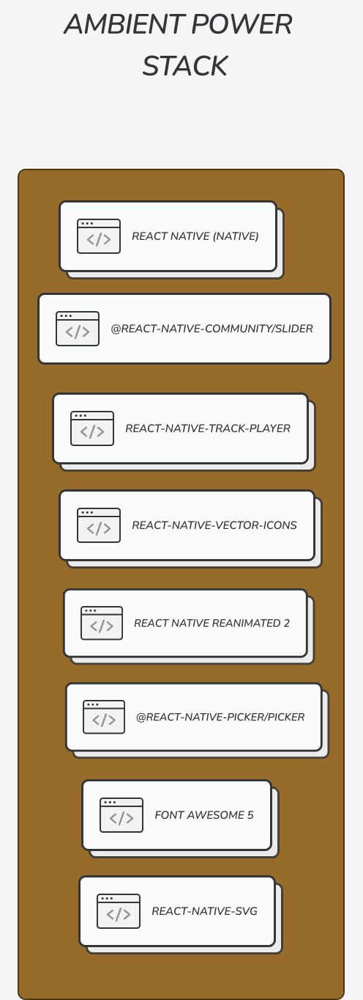

## What the app is for

Ambient Noise is designed to help you sleep, study or get in the zone. It's basically a "white noise" creation app (which actually uses brown and pink noise). 

# Videos

## How To Use:

https://user-images.githubusercontent.com/43282635/235081663-7b0eb525-e9cb-47ff-9193-e087195f4860.mp4

## How to use the Timer:

https://user-images.githubusercontent.com/43282635/235081719-fd53c90c-8e15-46f7-afb5-5e79378e764f.mp4

# Screenshots

## Focus:

## Relax:

## Sleep:

## Study:

## Cruise:

# How the app is started

To install...

- npm i
- cd ios
- pod install

In npm scripts...

- Run "start" 1st
- Then ios. Should open in the simulator

## Ambient Architecture

